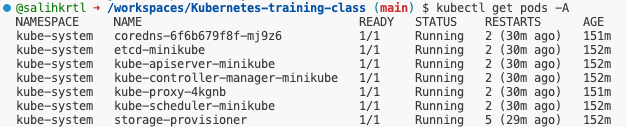

İşte detaylı anlatımları ve ekran görüntüsü için boş alanları olan `kubectl get pods` komutları tablosu:

| Komut                                                     | Açıklama                                                                                          | Ekran Görüntüsü  |
|----------------------------------------------------------|--------------------------------------------------------------------------------------------------|------------------|
| `kubectl get pods`                                        | Varsayılan ad alanındaki (namespace) Pod'ları listeler.                                           |                  |
| `kubectl get pods -A`                                     | Tüm ad alanlarındaki Pod'ları listeler.                                                           |                  |
| `kubectl get pods -n <namespace>`                         | Belirtilen ad alanındaki Pod'ları listeler. `<namespace>` ad alanının ismi ile değiştirilmelidir.  |                  |
| `kubectl get pods -o wide`                                | Pod'lar hakkında daha ayrıntılı bilgi verir (IP adresi, node adı, vs.).                           |              |
| `kubectl get pods -o yaml`                                | Pod'ların YAML formatında tam tanımını gösterir.                                                  |                  |
| `kubectl get pods -o json`                                | Pod'ların JSON formatında tam tanımını gösterir.                                                  |                  |
| `kubectl get pods --watch`                                | Pod'ların durumunu sürekli olarak izler ve değişiklikleri anında gösterir.                        |                  |
| `kubectl get pods --field-selector=status.phase=Running`  | Sadece çalışan (Running) durumda olan Pod'ları listeler.                                          |                  |
| `kubectl get pods -l <label-key>=<label-value>`           | Belirli bir etikete (label) sahip Pod'ları listeler.                                              |                 |
| `kubectl get pods --sort-by=.metadata.name`               | Pod'ları belirli bir alana göre sıralayarak listeler (bu örnekte isme göre sıralar).              |                  |
| `kubectl get pods -o custom-columns=<column-name1>=<json-path1>,<column-name2>=<json-path2>` | Özel sütunlar oluşturarak belirli bilgileri gösterir. |                  |
| `kubectl get pods --all-namespaces -o jsonpath='{.items[*].metadata.name}'` | Tüm Pod'ların isimlerini JSONPath kullanarak liste halinde gösterir.                         |                  |
| `kubectl get pods --show-labels`                          | Pod'ların sahip olduğu etiketleri (labels) gösterir.                                              |                  |
| `kubectl get pods --no-headers`                           | Pod listesini başlık olmadan gösterir.                                                            |                  |
| `kubectl get pods -o name`                                | Pod'ların sadece adlarını listeler.                                                               |                  |
| `kubectl get pods -o go-template='{{range .items}}{{.metadata.name}}{{"\n"}}{{end}}'` | Go template kullanarak Pod'ların adlarını özelleştirilmiş biçimde listeler.                     |                  |

Bu tabloyu kullanarak ilgili komutları çalıştırabilir ve sonuçlarını ekran görüntüsü olarak ekleyebilirsiniz.
